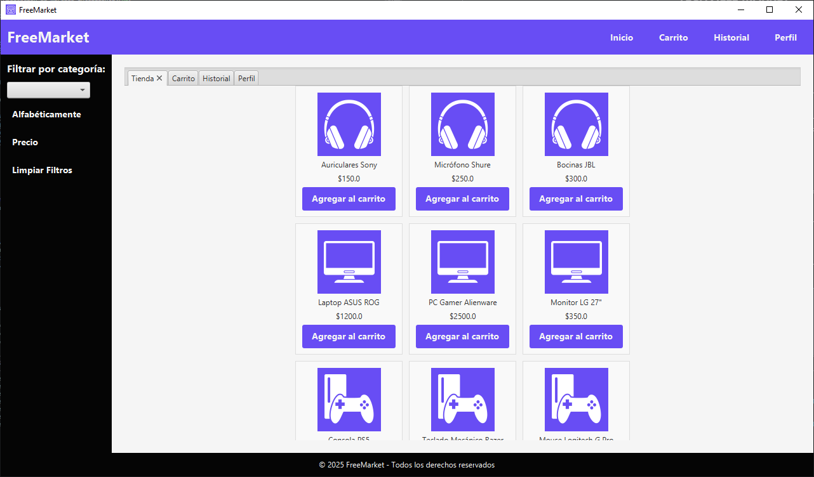
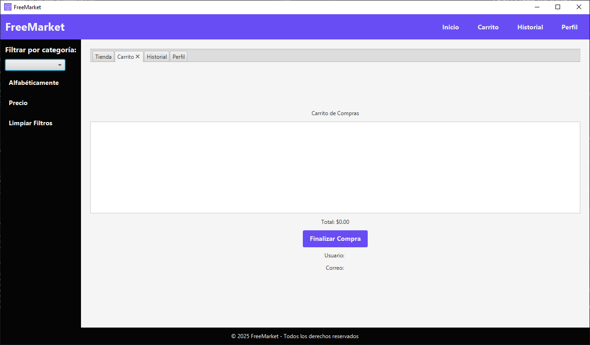
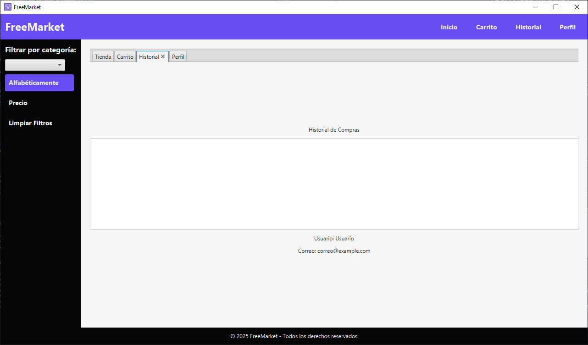
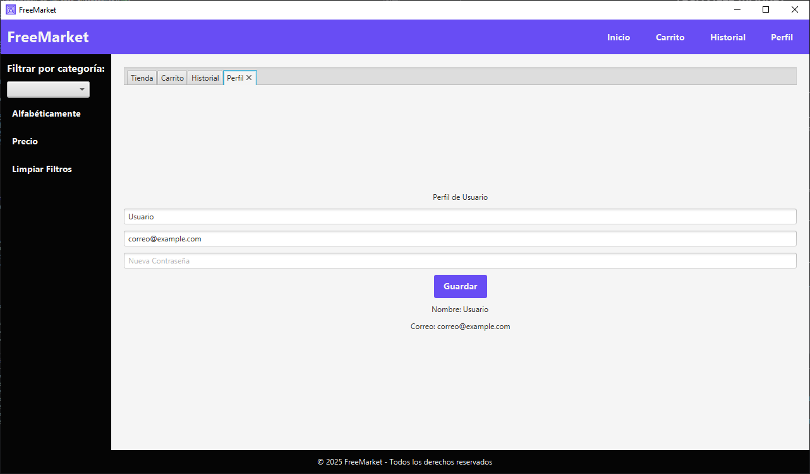

<h1 align="center">TECHVILLE MARKET</h1>
<h3 align="center">Aplicación de mercado inteligente</h3>

<h3 align="center">Herramientas/h3>

  

<!-- TANLA DE CONTENIDOS-->

  
Tabla de contenidos

  <ol>
    <li><a href="#about">Acerca del reto</a></li>
    <li><a href="#gallery">Galeria</a></li>
    <li><a href="#code">Estructura de código</a></li>
    <li><a href="#usage">Usage</a></li>
    <li><a href="#credits">Integrantes</a></li>
  </ol>

---

<!-- acerca del reto -->
<h2 id="about">Acerca Del Reto</h2>
<h6>Contexto</h6>

Las ciudades modernas dependen de la tecnología para mejorar sueficiencia, y en esta maratón de programación, te convertirás en undesarrollador clave para el proyecto "Mercado Inteligente", unaplataforma digital diseñada para transformar la experiencia decompra en TechVille.En esta Batalla de Universidades, cada equipo deberá construir unsistema funcional con Programación Orientada a Objetos (POO) quepermita gestionar un carrito de compras, calcular costos, aplicardescuentos y ofrecer una interfaz gráfica de usuario (GUI) amigablepara los clientes.

<h6>Objetivo</h6>

Desarrollar una aplicación de Mercado Inteligente con una interfazgráfica intuitiva, aplicando todos los pilares de la POO:

<ul>
  <li>Abstracción</li>
  <li>Encapsulamiento</li>
  <li>Herencia</li>
  <li>Polimorfismo</li>
</ul>

El sistema debe permitir la gestión de productos, la compra deartículos y el cálculo de descuentos de manera estructurada y eficiente.

<!-- Galleria -->
<h2 id="gallery">Galería</h2>

  
  

  
  

<!-- Código -->
<h2 id="code">Estructura de Código</h2>
<h5>Clases.</h5>
<h6>Package: Controler - Cart</h6>
<pre>
<code>
package controller;

import model.Product;
import java.util.ArrayList;
import java.util.List;

public class Cart {
    private List<Product> cartItems = new ArrayList<>();

    public void addToCart(Product product) {
        cartItems.add(product);
    }

    public List<Product> getCartItems() {
        return cartItems;
    }

    public double calculateTotal() {
        double total = cartItems.stream().mapToDouble(Product::getPrice).sum();
        return applyDiscount(total, cartItems.size());
    }

    private double applyDiscount(double total, int itemCount) {
        int discountLevel = Math.min(itemCount / 5, 8);
        double discount = discountLevel * 5.0;
        return total * (1 - discount / 100);
    }    

    public void clearCart() {
        cartItems.clear();
    }    
}

</code>
</pre>
<h6>Package: Controler - Store</h6>
<pre>
<code>
package controller;

import model.Product;
import model.Category;
import java.util.ArrayList;
import java.util.List;

public class Store {
    private List<Product> products = new ArrayList<>();

    public Store() {
        loadProducts();
    }

    private void loadProducts() {
        products.add(createProduct(Category.AUDIO, "Auriculares Sony", 150, 10, "/resources/audio.png"));
        products.add(createProduct(Category.AUDIO, "Micrófono Shure", 250, 7, "/resources/audio.png"));
        products.add(createProduct(Category.AUDIO, "Bocinas JBL", 300, 5, "/resources/audio.png"));

        products.add(createProduct(Category.COMPUTERS, "Laptop ASUS ROG", 1200, 5, "/resources/computers.png"));
        products.add(createProduct(Category.COMPUTERS, "PC Gamer Alienware", 2500, 3, "/resources/computers.png"));
        products.add(createProduct(Category.COMPUTERS, "Monitor LG 27\"", 350, 6, "/resources/computers.png"));

        products.add(createProduct(Category.GAMING, "Consola PS5", 499, 12, "/resources/gaming.png"));
        products.add(createProduct(Category.GAMING, "Teclado Mecánico Razer", 130, 10, "/resources/gaming.png"));
        products.add(createProduct(Category.GAMING, "Mouse Logitech G Pro", 80, 15, "/resources/gaming.png"));

        products.add(createProduct(Category.SMARTPHONES, "iPhone 15", 999, 8, "/resources/smarthphone.png"));
        products.add(createProduct(Category.SMARTPHONES, "Samsung Galaxy S23", 850, 10, "/resources/smarthphone.png"));
        products.add(createProduct(Category.SMARTPHONES, "Google Pixel 7", 750, 7, "/resources/smarthphone.png"));

        products.add(createProduct(Category.TABLETS, "iPad Pro", 1100, 6, "/resources/tablets.png"));
        products.add(createProduct(Category.TABLETS, "Samsung Galaxy Tab S8", 900, 8, "/resources/tablets.png"));
        products.add(createProduct(Category.TABLETS, "Microsoft Surface Pro", 1200, 4, "/resources/tablets.png"));

        products.add(createProduct(Category.TELEVISION, "Samsung QLED 55\"", 1400, 4, "/resources/television.png"));
        products.add(createProduct(Category.TELEVISION, "LG OLED 65\"", 2200, 3, "/resources/television.png"));
        products.add(createProduct(Category.TELEVISION, "Sony Bravia XR", 1800, 5, "/resources/television.png"));

        products.add(createProduct(Category.VIDEO, "Cámara Canon EOS R5", 3500, 2, "/resources/video.png"));
        products.add(createProduct(Category.VIDEO, "GoPro Hero 11", 500, 10, "/resources/video.png"));
        products.add(createProduct(Category.VIDEO, "Dron DJI Mavic Air 2", 1200, 5, "/resources/video.png"));
    }

    private Product createProduct(Category category, String name, double price, int stockQuantity, String imagePath) {
        String fullPath = getClass().getResource(imagePath) != null ? getClass().getResource(imagePath).toString() : "";
        return new Product(category, name, price, stockQuantity, fullPath);
    }
    
    public List<Product> getProducts() {
        return products;
    }
}

</code>
</pre>
<h6>Package: Controler - Controller</h6>
<pre>
<code>
package controller;

import controller.Store;
import controller.Cart;
import model.User;
import model.Product;
import model.Category;
import javafx.fxml.FXML;
import javafx.collections.FXCollections;
import javafx.collections.ObservableList;
import javafx.scene.control.*;
import javafx.scene.image.Image;
import javafx.scene.image.ImageView;
import javafx.scene.layout.GridPane;
import javafx.scene.layout.VBox;
import javafx.stage.Stage;
import javafx.scene.control.Button;

import java.util.List;

public class Controller {
    private Store store = new Store();
    private Cart cart = new Cart();
    private User user;
    private Stage stage;

    public Controller() {
        this.user = new User("Usuario", "correo@example.com");
    }

    public void setStage(Stage stage) {
        this.stage = stage;
    }

    @FXML private TabPane tabPane;
    @FXML private GridPane productGrid;
    @FXML private ListView<Product> cartList;
    @FXML private ListView<String> historyList;
    @FXML private Label totalLabel;
    @FXML private ComboBox<Category> categoryFilter;
    @FXML private Label userLabel;
    @FXML private Label userNameLabel;
    @FXML private Label userEmailLabel;
    @FXML private TextField nameField;
    @FXML private TextField emailField;
    @FXML private PasswordField passwordField;
    @FXML private Button saveProfileButton;
    @FXML private Label profileNameLabel;
    @FXML private Label profileEmailLabel;

    public void initialize() {
        updateUserInterface();
        initializeProductGrid();
        initializeProfile();
    }

    private void updateUserInterface() {
        if (userLabel != null) {
            userLabel.setText("Bienvenido, " + user.getName());
        }
        userNameLabel.setText("Usuario: " + user.getName());
        userEmailLabel.setText("Correo: " + user.getEmail());
    }

    private void initializeProductGrid() {
        loadProducts(store.getProducts());
        categoryFilter.getItems().addAll(Category.values());
        categoryFilter.setOnAction(e -> filterProducts());
    }

    private void loadProducts(List<Product> products) {
        productGrid.getChildren().clear();
        int row = 0, col = 0;
        for (Product product : products) {
            VBox productBox = createProductBox(product);
            productGrid.add(productBox, col, row);

            col++;
            if (col > 2) {
                col = 0;
                row++;
            }
        }
    }

    private VBox createProductBox(Product product) {
        ImageView imageView = new ImageView(new Image(product.getImagePath()));
        imageView.setFitWidth(100);
        imageView.setFitHeight(100);

        Label nameLabel = new Label(product.getName());
        Label priceLabel = new Label("$" + product.getPrice());
        Button addToCartButton = new Button("Agregar al carrito");
        addToCartButton.setOnAction(event -> addToCart(product));

        VBox productBox = new VBox(5, imageView, nameLabel, priceLabel, addToCartButton);
        productBox.setStyle("-fx-padding: 10px; -fx-border-color: #ddd; -fx-background-color: #f9f9f9; -fx-alignment: center;");
        return productBox;
    }

    @FXML
    private void addToCart(Product product) {
        cart.addToCart(product);
        cartList.getItems().add(product);
        updateTotal();
    }

    public void clearCart() {
        cart.clearCart();
        cartList.getItems().clear();
        updateTotal();
    }

    @FXML
    private void checkout() {
        if (!cartList.getItems().isEmpty()) {
            historyList.getItems().add("Compra realizada: $" + cart.calculateTotal());
            cartList.getItems().clear();
            cart.clearCart();
            updateTotal();
        }
    }

    private void updateTotal() {
        totalLabel.setText("Total: $" + cart.calculateTotal());
    }

    private void filterProducts() {
        Category selectedCategory = categoryFilter.getValue();
        List<Product> filteredList = store.getProducts().stream()
                .filter(p -> selectedCategory == null || p.getCategory() == selectedCategory)
                .toList();
        loadProducts(filteredList);
    }

    @FXML
    private void clearFilters() {
        categoryFilter.setValue(null);
        loadProducts(store.getProducts());
    }

    @FXML
    private void sortByName() {
        List<Product> sortedList = store.getProducts().stream()
                .sorted((p1, p2) -> p1.getName().compareToIgnoreCase(p2.getName()))
                .toList();
        loadProducts(sortedList);
    }

    @FXML
    private void sortByPrice() {
        List<Product> sortedList = store.getProducts().stream()
                .sorted((p1, p2) -> Double.compare(p1.getPrice(), p2.getPrice()))
                .toList();
        loadProducts(sortedList);
    }

    @FXML
    private void viewProfile() {
        tabPane.getSelectionModel().select(3);
    }

    @FXML
    private void viewCart() {
        tabPane.getSelectionModel().select(1);
    }

    @FXML
    private void viewHistory() {
        tabPane.getSelectionModel().select(2);
    }

    @FXML
    private void goHome() {
        tabPane.getSelectionModel().select(0);
        loadProducts(store.getProducts());
    }

    private void initializeProfile() {
        nameField.setText(user.getName());
        emailField.setText(user.getEmail());
        profileNameLabel.setText("Nombre: " + user.getName());
        profileEmailLabel.setText("Correo: " + user.getEmail());
    }

    @FXML
    private void saveProfile() {
        String newName = nameField.getText().trim();
        String newEmail = emailField.getText().trim();

        if (!newName.isEmpty() && !newEmail.isEmpty()) {
            user.setName(newName);
            user.setEmail(newEmail);
            updateUserInterface();
            initializeProfile();
            showAlert("Perfil actualizado", "Los datos del perfil han sido guardados correctamente.");
        } else {
            showAlert("Error", "Por favor, completa todos los campos.");
        }
    }

    private void showAlert(String title, String message) {
        Alert alert = new Alert(Alert.AlertType.INFORMATION);
        alert.setTitle(title);
        alert.setHeaderText(null);
        alert.setContentText(message);
        alert.showAndWait();
    }
}

</code>
</pre>
<h6>Package: Model</h6>

Paquete encargado de la creación de los productos y usuario.

<h6>Package: Model - Product / Category</h6>
<pre>
<code>
package model;

import javafx.scene.image.Image;

public class Product {
    private Category category;
    private String name;
    private double price;
    private int stockQuantity;
    private int cartQuantity;
    private Image img;
    private String imgPath;

    public Product(Category category, String name, double price, int stockQuantity, String imgPath) {
        this.category = category;
        this.name = name;
        this.price = price;
        this.stockQuantity = stockQuantity;
        this.cartQuantity = 0;
        this.imgPath = imgPath;
        this.img = new Image(imgPath);
    }

    public Category getCategory() { return category; }
    public String getName() { return name; }
    public double getPrice() { return price; }
    public int getStockQuantity() { return stockQuantity; }
    public int getCartQuantity() { return cartQuantity; }
    public String getImagePath() { return imgPath; }
    public Image getImage() { return img; }

    public void setCartQuantity(int cartQuantity) {
        if (cartQuantity >= 0 && cartQuantity <= stockQuantity) {
            this.cartQuantity = cartQuantity;
        }
    }

    public void reduceStock() {
        if (cartQuantity > 0) {
            stockQuantity -= cartQuantity;
            cartQuantity = 0;
        }
    }

    @Override
    public String toString() {
        return name + " - $" + price + " (Stock: " + stockQuantity + ")";
    }
}

package model;

public enum Category {
    AUDIO,
    COMPUTERS,
    GAMING,
    SMARTPHONES,
    TABLETS,
    TELEVISION,
    VIDEO;
}

</code>
</pre>
<h6>Package: Model - User</h6>
<pre>
<code>

</code>
</pre>

<!-- Uso -->
<h2 id="usage">Installación</h2>

Explain how to use the project, provide examples, or show screenshots.

<pre>
<code>
{
    "version": "0.2.0",
    "configurations": [
        {
            "type": "java",
            "request": "launch",
            "name": "Launch JavaFX App",
            "mainClass": "Main", 
            "vmArgs": "--module-path \"La ubicación de tu SDK" --add-modules javafx.controls,javafx.fxml"
        },
        {
            "type": "java",
            "name": "Main",
            "request": "launch",
            "mainClass": "Main",
            "projectName": "TechVille_e0bcc106"
        }
    ]
}
</code>
</pre>

<pre>
<code>
{
    "java.project.sourcePaths": [
        "src"
    ],
    "java.project.referencedLibraries": [
        // Dentro de la carpeta lib, se encuentra cada uno de los elementos de JavaFX que se necesitan
    ]
}
</code>
</pre>

<!-- Credits -->

<h2 id="credits">Creditos</h2>

Pueden encontrar el enlace del video del proyecto en el siguiente enlace

<strong>Youtube:</strong> <a href="#">Presiona aqui</a>

<h6>Integrantes</h6>

  <strong>Participante 1:</strong> Alejandro Ramirez 
  <strong>GitHub:</strong> <a href="https://github.com/Alejo12680">https://github.com/Alejo12680</a>
   
  <strong>Participante 2:</strong> Jhonatan Benavides 
  <strong>GitHub:</strong> <a href="https://github.com/jhona-esteban">https://github.com/jhona-esteban</a>
   
  <strong>Participante 3:</strong> Samuel Rivera 
  <strong>GitHub:</strong> <a href="https://github.com/dnbsammie">https://github.com/dnbsammie</a>

